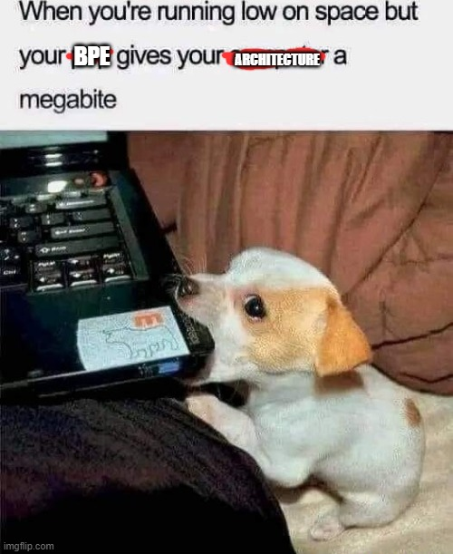

# minbpe
(Re)Implementation of Karpathy's minimal Byte Pair Encoding repo (minbpe) [Karpathy's Repo](https://github.com/karpathy/minbpe)
<!---

-->

Minimal code for the (byte-level) Byte Pair Encoding (BPE) algorithm commonly used in LLM tokenization. 
The BPE algorithm is "byte-level" because it runs on UTF-8 encoded strings.

This algorithm was popularized for LLMs by the [GPT-2 paper](https://d4mucfpksywv.cloudfront.net/better-language-models/language_models_are_unsupervised_multitask_learners.pdf) and the associated GPT-2 [code release](https://github.com/openai/gpt-2) from OpenAI. 
[Sennrich et al. 2015](https://arxiv.org/abs/1508.07909) is cited as the original reference for the use of BPE in NLP applications. 
Today, all modern LLMs (e.g. GPT, Llama, Mistral) use this algorithm to train their tokenizers.

There are two Tokenizers in this repository, both of which can perform the 3 primary functions of a Tokenizer: 
- train the tokenizer vocabulary and merges on a given text
- encode from text to tokens
- decode from tokens to text 


The files of the repo are as follows:
1. [minbpe/base.py](minbpe/base.py): Implements the `Tokenizer` class, which is the base class. It contains the `train`, `encode`, and `decode` stubs, save/load functionality, and there are also a few common utility functions. This class is not meant to be used directly, but rather to be inherited from.
2. [minbpe/simple.py](minbpe/simple.py): Implements the `SimpleTokenizer`, the simplest implementation of the BPE algorithm that runs directly on text.
3. [TODO] regex tokenizer
4. [TODO] GPT-4 tokenizer

Finally, the script [train.py](train.py) trains the two major tokenizers on the input text [tests/taylorswift.txt](tests/taylorswift.txt) and saves the vocab to disk for visualization.


## Usage

As the simplest example, we can reproduce the [Wikipedia article on BPE](https://en.wikipedia.org/wiki/Byte_pair_encoding) as follows:
```python
from minbpe import SimpleTokenizer
tokenizer = SimpleTokenizer()
text = "aaabdaaabac"
tokenizer.train(text, 256 + 3) # 256 are the byte tokens, then do 3 merges
print(tokenizer.encode(text))
# [258, 100, 258, 97, 99]
print(tokenizer.decode([258, 100, 258, 97, 99]))
# aaabdaaabac
tokenizer.save("toy")
# writes two files: toy.model (for loading) and toy.vocab (for viewing)
```

According to Wikipedia, running bpe on the input string: "aaabdaaabac" for 3 merges results in the string: "XdXac" where X=ZY, Y=ab, and Z=aa. 
The tricky thing to note is that minbpe always allocates the 256 individual bytes as tokens, and then merges bytes as needed from there. 
So for us a=97, b=98, c=99, d=100 (their ASCII values). Then when (a,a) is merged to Z, Z will become 256. 
Likewise, Y will become 257 and X 258. So we start with the 256 bytes, and do 3 merges to get to the result above, with the expected output of [258, 100, 258, 97, 99].